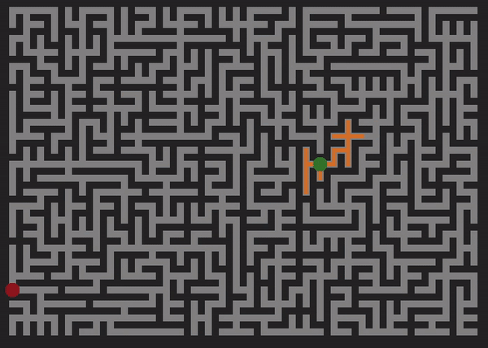
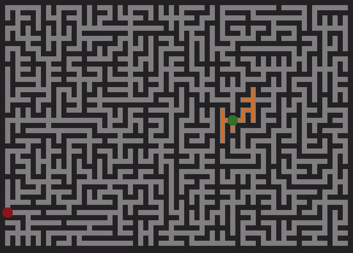
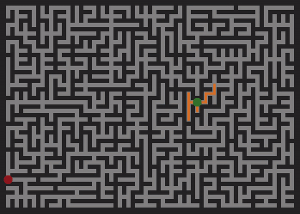
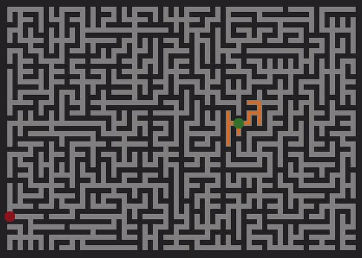

# Maze Runner

## Background
Maze Runner is a visualization tool for maze generation and path solving using JavaScript and HTML5 Canvas. It provides insight into the behavior of popular maze generation and traversal algorithms, such as Depth-First Search (DFS), Breadth-First Search (BFS), Dijkstra's Algorithm and A*.

## Technologies
  * Javascript - implement algorithms
  * jQuery - DOM manipulation & event handling
  * HTML5 Canvas - draw maze, path and visualization of algorthims traversing the maze
  * CSS - styling

## Prim's Algorithm

Figure 1. Visualization of Prim's Algorithm Generating Random Maze

The maze is generated using Prim's algorithm, a greedy algorithm that grows a minimum spanning tree from a starting source node until it covers the entire graph. A minimum spanning tree is a subset of all the edges in a graph that connects each of the nodes in the graph, but does not have any cycles. Each of the edges is assigned a random weight and the tree is built by selecting the cheapest edge that doesn't have a cycle. This is why Prim's is considered a greedy algorithm, as it takes the path with the least weight every time. Prim's algorithm does not, however, select the cheapest edge that will connect any pair of vertices, but rather edges that will connect to the existing tree. This is why, in Figure 1, you will not see edges being added in open space. It doesn't start with every edge in the grid in its queue, so it only can choose from edges that are connected to vertices it has visited. You will notice, however, that as the tree grows it will select edges that were added to the queue much earlier. This is evident by how edges get added to the existing tree all over the place.

Prim's algorithm requires a priority queue to keep track of the edges. The most expensive approach in terms of time complexity is to use an array that stores all of the edges and linearly searches for the cheapest one each time. This approach would run in O(E) time, where E represents the number of edges in the graph. I decided to implement a binary heap. This is implemented with a binary tree that organizes the edges in the priority queue by weight. The edge with the minimum weight is always at the root of the tree. Whenever the min edge is removed, the tree is reprioritized by placing the last edge in the tree at the root and letting it sink down. Every node in the tree, which represents one of the edges in the graph, has a maximum of 2 children. To sink down, it checks whether it is greater than either of its children, and swaps with the min. This is a log E operation, as there will be a maximum of log E levels in the tree. Whenever a new edge is added, it bubbles up. The bubble up process works similarly to the sink down process and also runs in log E time. Therefore, in the worst case scenario, Prim's algorithm with a binary heap has E log E time complexity because there are E edges in the graph and each addition or removal from the queue requires a log E reprioritization. Another way to further improve on this time complexity would be to store vertices in the heap instead of edges. The vertices could be stored by the smallest edge weight that connects them to some other vertex in the existing tree. This leads to O(E log V) runtime. A further reduction in runtime could be achieved with a Fibonnacci heap.

## Breadth-First Search

Figure 2. Visualization of BFS Traversing Maze and Constructing Path

Breadth-First Search (BFS) is an algorithm that can be used for a number of tasks, but in this case will be used to find a path between randomly-chosen start and goal nodes. BFS is implemented with a queue. It starts by visiting a node, then adding all of that node's neighbors into the queue. Each time it adds a neighbor to the queue, it adds a pointer that references the neighboring node's parent. The reason for this is that it doesn't actually construct the path during its initial traversal of the graph. It repeats the process of visiting the nodes in the order they entered the queue until the queue is empty, which means all nodes have been visited, or until the goal node is found, since I use an early exit in my implementation. Once the traversal is complete, it starts at the goal node and follows the pointers until it reaches the start node.

Figure 3. Illustration of Order that Nodes are Visited in BFS

As evident by Figure 3, BFS considers shallower nodes in the tree before moving onto their children, which is why in Figure 2 it expands equally in all directions away from the start node. Due to the nature of the maze, it may appear as if the algorithm is favoring the right side, but it is expanding evenly in the directions that are available to it.

## Depth-First Search

## Dijkstra's Algorithm

## A*

## Resources
* https://bost.ocks.org/mike/algorithms/
* https://visualgo.net/en
* https://www.redblobgames.com/
* https://medium.com/basecs/tagged/algorithms
* http://www.how2examples.com/artificial-intelligence/images/Breadth-First-Search.gif
* https://upload.wikimedia.org/wikipedia/commons/7/7f/Depth-First-Search.gif
